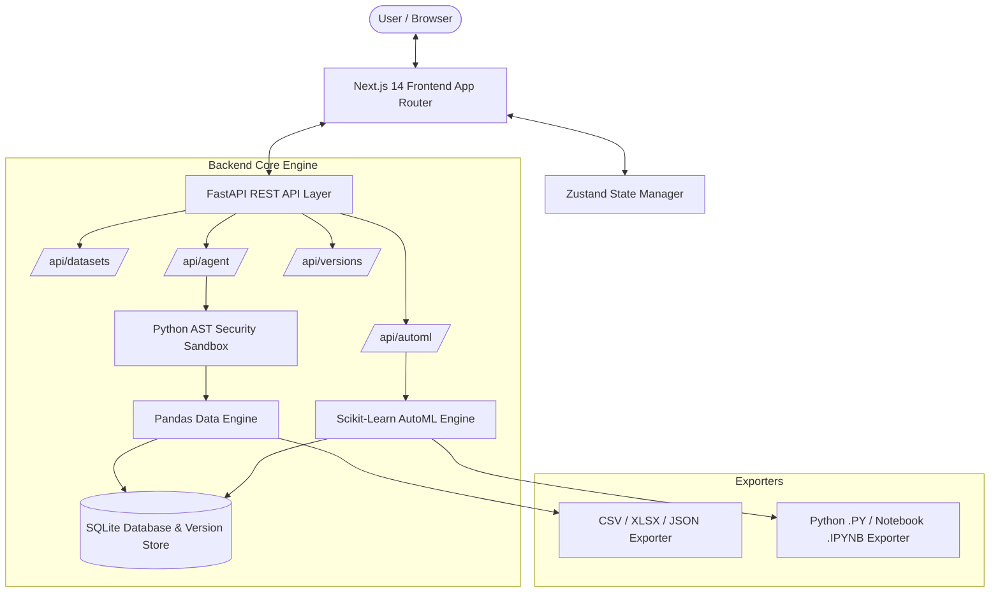

<div align="center">

# ⚡ DataForge AI

### *Next-Generation Conversational AutoML & Sandboxed Data Science Workbench*

[](https://nextjs.org/)
[](https://fastapi.tiangolo.com/)
[](https://python.org)
[](https://scikit-learn.org/)
[](https://threejs.org/)
[](https://github.com/)
[](LICENSE)

<p align="center">
  <b>Transform, profile, wrangle, and model structured datasets using natural language — backed by deterministic AST-sandboxed Python execution and full reproducible version lineage.</b>
</p>

---

</div>

## 📖 Table of Contents

- [Executive Overview](#-executive-overview)
- [Key Platform Features](#-key-platform-features)
- [System Architecture](#-system-architecture)
- [Python AST Security Sandbox](#-python-ast-security-sandbox)
- [Tech Stack](#-tech-stack)
- [Getting Started](#-getting-started)
  - [Prerequisites](#prerequisites)
  - [Backend Setup](#1-backend-setup)
  - [Frontend Setup](#2-frontend-setup)
  - [Environment Configuration](#3-environment-configuration)
- [API Reference](#-api-reference)
- [Project Layout](#-project-layout)
- [Reproducible Code & Export System](#-reproducible-code--export-system)
- [License](#-license)

---

## 🚀 Executive Overview

**DataForge AI** is an enterprise-grade full-stack data science workbench built for modern teams who demand the speed of conversational AI paired with the rigorous safety of 100% deterministic code execution. 

Unlike traditional black-box AI tools, DataForge AI evaluates all natural language data transformation requests through a **strict Python Abstract Syntax Tree (AST) Security Sandbox**. The platform computes statistical profiles in real-time, displays interactive spreadsheet grids, executes automated machine learning (AutoML) pipelines, tracks immutable version lineage trees, and generates 100% standalone, reproducible Python (`.py`) scripts and Jupyter Notebooks (`.ipynb`).

---

## ✨ Key Platform Features

### 📊 1. Instant Statistical Profiling & Sparklines
- **Automated Data Quality Audit**: Calculates total rows, column counts, missingness percentages, duplicate row alerts, and column data type inferencing in milliseconds.
- **Visual Sparkline Histograms**: Generates distribution sparklines and numerical frequency bins directly inside column breakdown tables.
- **Type Coercion & Category Insights**: Inspect top category frequencies, numeric ranges, and sample values per column.

### 💬 2. Sandboxed AI Data Copilot
- **Conversational Data Wrangling**: Ask questions or instruct data modifications in plain English (e.g., *"Impute missing values in math_score with median and normalize reading_score"*).
- **Whitelisted AST Code Execution**: Converts natural language into pandas operations verified against a security whitelist before execution.
- **Traceable Computation Logs**: Inspect exact pandas code snippets generated for every response.

### 📋 3. High-Density Smart Spreadsheet Grid
- **Interactive Data Table**: View dataset rows with search filtering, column sorting, pagination, and type indicators.
- **Immediate Data Preview**: Real-time inspection of modified dataset versions without full page reloads.

### 🤖 4. End-to-End AutoML Studio
- **Automatic Problem Classification**: Auto-detects target columns and determines whether the task is **Regression** or **Classification**.
- **Automated Data Cleaning**: Auto-handles missing value imputation, categorical encoding, and feature scaling.
- **Multi-Algorithm Leaderboards**: Trains and evaluates candidate models (XGBoost, Random Forest, Logistic Regression, Linear Regression, Ridge) with complete performance metrics ($R^2$, RMSE, Accuracy, F1-Score, Confusion Matrices).

### 🌳 5. Immutable Version Lineage Tree
- **Git-Style Data Versioning**: Every transformation creates an immutable new dataset version linked to its parent version.
- **Lineage Audit & Instant Revert**: Compare version diffs and switch or restore canonical dataset states seamlessly.

### 📦 6. Single-Shot Reproducible Code & Dataset Export
- **Multi-Format Dataset Download**: Export cleaned datasets as `.CSV`, `.XLSX`, or `.JSON`.
- **Standalone Code Export**: Export complete, standalone Python scripts (`.py`) or Jupyter Notebooks (`.ipynb`) containing every transformation and model training step—runnable anywhere with standard `pandas` and `scikit-learn`.

### 🎨 7. 100k Light Theme SaaS Aesthetic & 3D Canvas
- **Titanium Porcelain UI**: Clean light-mode design system with Sky Blue (`#0284c7`) and Champagne Gold (`#f59e0b`) accents, glassmorphism cards, and crisp typography.
- **Three.js Particle Backdrop**: Interactive 3D particle canvas rendered via React Three Fiber, automatically unmounted during heavy spreadsheet tasks for optimal performance.

---

## 🏗️ System Architecture



---

## 🛡️ Python AST Security Sandbox

DataForge AI guarantees safety when executing LLM-generated Python code by evaluating Abstract Syntax Trees before execution:

```
[ Natural Language Prompt ]
            │
            ▼
[ LLM Code Generation ]
            │
            ▼
[ Python ast.parse() Tree Inspection ]
            │
      ┌─────┴────────────────────────┐
      │ Allowed AST Nodes Only       │
      │ • Subscript, Attribute, Assign│
      │ • Call (whitelisted methods) │
      └─────┬────────────────────────┘
            │
    Is Safe & Approved?
    ├────── NO  ──► [ Reject Execution & Return Security Error ]
    │
    └────── YES ──► [ Sandboxed Safe Execution Environment ]
```

### Whitelisted Security Rules:
- **Forbidden Imports**: `os`, `sys`, `subprocess`, `shutil`, `importlib`, `socket`, `builtins`.
- **Forbidden Primitives**: `eval()`, `exec()`, `open()`, `__import__()`, `getattr()`, `setattr()`.
- **Allowed Operations**: Pandas DataFrame indexing, mathematical operations, standard aggregations (`mean`, `median`, `fillna`, `drop`, `rename`, `replace`, `astype`).

---

## 🛠️ Tech Stack

| Domain | Technology | Description |
| :--- | :--- | :--- |
| **Frontend Framework** | Next.js 14 (App Router) | React server/client architecture with TypeScript |
| **Styling & Design** | Tailwind CSS | Custom Light Theme porcelain design tokens & utilities |
| **3D & Graphics** | Three.js / React Three Fiber | Interactive floating particle canvas |
| **State Management** | Zustand | Lightweight reactive state store |
| **Syntax Highlighting**| React Syntax Highlighter | Code block rendering with Prism |
| **Backend Framework** | FastAPI | Asynchronous Python REST API framework |
| **Database & ORM** | SQLAlchemy 2.0 (Async) + SQLite | Persistent metadata, datasets, and version lineage store |
| **Data Science & ML** | Pandas, NumPy, Scikit-Learn | Data wrangling, statistical profiling, and model training |
| **Code Generation** | Python AST | Security whitelisted AST parser and code generator |

---

## 🏁 Getting Started

### Prerequisites
- **Node.js**: v18.0.0 or higher
- **Python**: v3.10 or higher
- **Package Managers**: `npm` and `pip`

---

### 1. Backend Setup

```bash
# Navigate to backend directory
cd backend

# Create virtual environment
python -m venv venv

# Activate virtual environment
# Windows (PowerShell):
.\venv\Scripts\Activate.ps1
# Linux / macOS:
source venv/bin/activate

# Install dependencies
pip install -r requirements.txt

# Copy environment variables
cp .env.example .env

# Start FastAPI application
uvicorn main:app --reload --port 8000
```
*Backend API will be running at `http://localhost:8000` (API Docs at `http://localhost:8000/docs`).*

---

### 2. Frontend Setup

```bash
# Open a new terminal and navigate to frontend directory
cd frontend

# Install dependencies
npm install

# Copy local environment variables
cp .env.example .env.local

# Run Next.js development server
npm run dev
```
*Frontend application will be accessible at `http://localhost:3000`.*

---

### 3. Environment Configuration

#### Backend `.env`:
```env
PROJECT_NAME="DataForge AI"
VERSION="1.0.0"
DATABASE_URL="sqlite+aiosqlite:///./dataforge.db"
SEED_DATA_DIR="./seed_data"
```

#### Frontend `.env.local`:
```env
NEXT_PUBLIC_API_BASE_URL="http://localhost:8000/api"
```

---

## 🔌 API Reference

| Method | Endpoint | Description |
| :--- | :--- | :--- |
| `GET` | `/api/health` | Returns backend status and version |
| `GET` | `/api/datasets` | List all uploaded and seed datasets |
| `POST` | `/api/datasets/upload` | Upload a new CSV or XLSX dataset |
| `POST` | `/api/datasets/load-seed` | Seed demo dataset (Student, Housing, Iris, Churn) |
| `GET` | `/api/datasets/{id}/profile` | Compute statistical profile and sparkline distributions |
| `GET` | `/api/datasets/{id}/preview` | Fetch paginated row preview for spreadsheet grid |
| `POST` | `/api/agent/chat` | Send conversational prompt to AST sandboxed copilot |
| `POST` | `/api/automl/pipeline` | Run end-to-end target detection, cleaning, and ML training |
| `GET` | `/api/versions/{version_id}/export-code` | Generate standalone `.py` or `.ipynb` code export |
| `GET` | `/api/datasets/{id}/download` | Download dataset version in `.CSV`, `.XLSX`, or `.JSON` |

---

## 📁 Project Layout

```
DataForge/
├── backend/
│   ├── app/
│   │   ├── api/             # FastAPI REST endpoint routes
│   │   │   ├── agent.py     # Conversational copilot router
│   │   │   ├── auto_ml.py   # AutoML pipeline router
│   │   │   ├── datasets.py  # Dataset management router
│   │   │   └── versions.py  # Version lineage & code export router
│   │   ├── core/            # App configuration & DB setup
│   │   ├── engine/          # Core Data Science & Security Engines
│   │   │   ├── auto_ml.py   # Sklearn training & evaluation engine
│   │   │   ├── code_generator.py # Standalone code export generator
│   │   │   ├── profiler.py  # Statistical profiling engine
│   │   │   ├── sandbox.py   # AST Security Whitelist sandbox
│   │   │   └── versioning.py# Immutable version tree manager
│   │   └── schemas/         # Pydantic schemas
│   ├── seed_data/           # Pre-loaded benchmark datasets
│   ├── main.py              # FastAPI entrypoint
│   └── requirements.txt     # Python dependencies
│
└── frontend/
    ├── src/
    │   ├── app/             # Next.js App Router pages & global CSS
    │   ├── components/      # Modular React Components
    │   │   ├── 3d/          # R3F DataParticles canvas
    │   │   ├── auto_ml/     # AutoML dashboard & leaderboards
    │   │   ├── chat/        # Conversational copilot panel
    │   │   ├── common/      # CodeExportModal & DownloadSplitButton
    │   │   ├── editor/      # Interactive Spreadsheet Grid
    │   │   ├── landing/     # Hero page & interactive teasers
    │   │   └── profiling/   # Statistical profiler dashboard
    │   └── lib/             # API client & Zustand store
    ├── tailwind.config.js   # Custom light mode theme tokens
    └── package.json         # Node dependencies
```

---

## 📄 License

Distributed under the **MIT License**. See `LICENSE` for more information.

---

<div align="center">
  <sub>Built with ❤️ by the DataForge AI Team.</sub>
</div>
